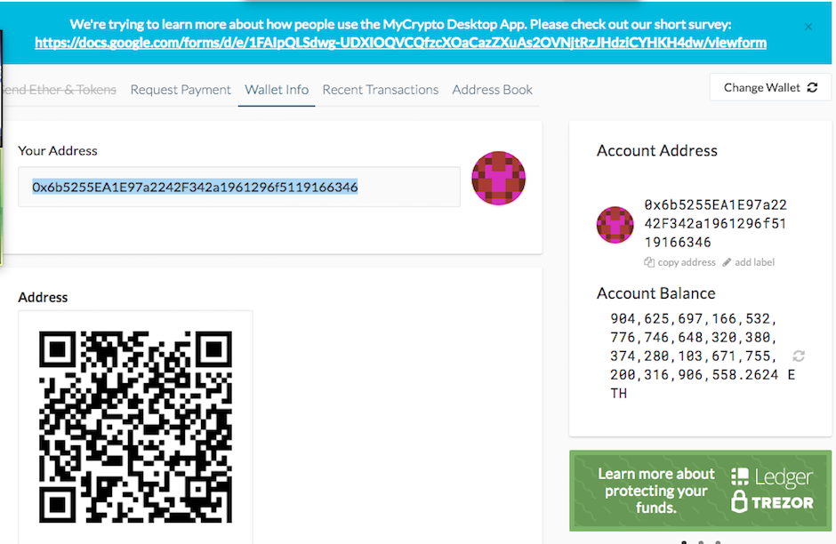

# Multi-Blockchain-Wallet-in-Python
Multi-Blockchain Wallet in Python

This Universal Wallet supports BIP32, BIP39, BIP44, and
also supports non-standard derivation. It is set up to work with Ethereum and Bitcoin-test.

### Bitcoin-test

   * Funding the first address with Bitcoin-test

   
   * Sending transaction
   

### For Ethereum

 * Funding the first address.
 

 * Sending transaction from the first address to another address
 

